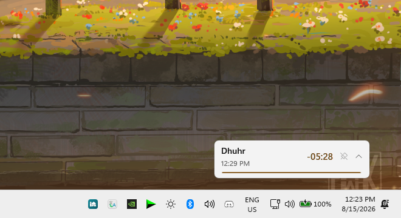

  

<h1 align="center">GoPray</h1>

A small, always-on-top prayer times widget for Windows. GoPray sits quietly on your desktop, shows the next prayer and a live countdown, and reminds you with a notification and the adhan when it's time — without getting in the way of whatever you're doing.

  

## Installation

[Releases](../../releases)
